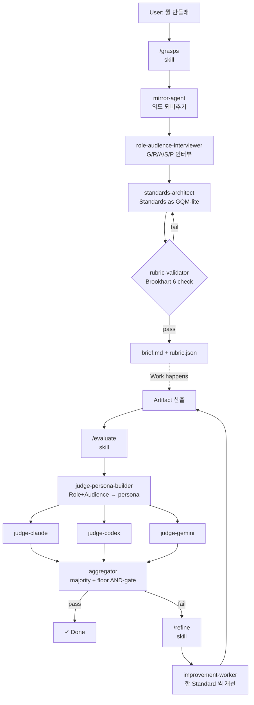
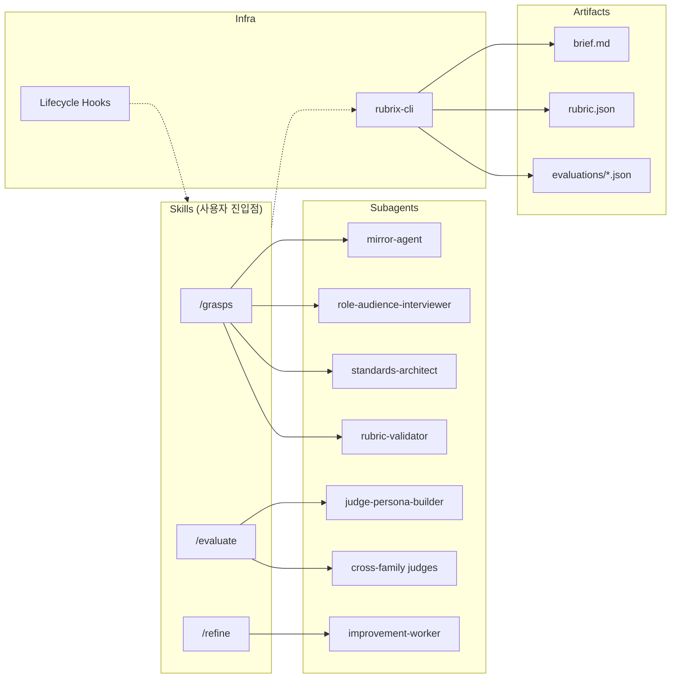

# 02 · Architecture — 한눈에

## 파이프라인 흐름

## 구성요소 지도

## 핵심 설계 결정 (trade-off 주석)

1. **GRASPS 를 hoyeon 의 `/specify` 로 대체하지 않고 별도 harness 로.** hoyeon 과 공존 가능. 사용자는 두 도구를 mix-and-match.
2. **`rubric.json` 을 `brief.md` 의 컴파일 결과로.** LLM 은 자연어, CLI 는 스키마. hoyeon 의 `requirements.md + plan.json` 분리 원칙을 계승.
3. **cross-family 강제.** self-preference bias 완화. CLI 없는 환경에서는 DEGRADED 모드로 Claude 단독 fallback (경고 출력).
4. **floor AND-gate.** 평균이 높아도 한 축 약하면 fail. 강점이 약점을 가리지 않도록.
5. **Refine 은 한 라운드 1 Standard.** 한 번에 여러 개 건드리면 회귀 원인 불명.
6. **WHERE grounding 으로 인터뷰 깊이 보정.** 장난감도 프로덕션도 같은 질문 세트 지옥 방지 (hoyeon 에서 검증된 패턴).
7. **Hook = 강제 검증, Skill = 대화.** brief 나 rubric 이 스키마를 어기면 hook 이 차단해서 하류로 흐르지 못하게 한다.

## 책임 분리 원칙

| 계층 | 담당 | 예시 |
|---|---|---|
| **Skill** | 사용자와 자연어로 대화, 의도 수집 | `/grasps` 가 AskUserQuestion 으로 R·A 채움 |
| **Subagent** | 특정 서브태스크 수행, 모델 독립적 | `standards-architect` 가 triple 초안 생성 |
| **Hook** | 스키마·규약 강제, deterministic | PostToolUse 에서 rubric.json 검증 |
| **CLI** | 상태·스키마·파싱, LLM 불필요 | `rubrix-cli rubric compile` |

이 분리가 흔들리면 "왜 이 결정이 여기서 났지?" 를 추적할 수 없게 된다.
