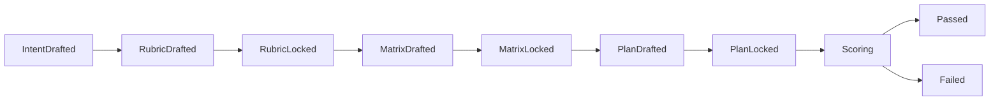

# Rubrix Extensible Documentation Plan

> Claude Code Harness First

> **Status (v1.0.0):** All target surface in this document is delivered. `claude plugin validate .` passes, 93 vitest tests pass, iter-4 benchmark hit with_skill 96.9% / +43.1pp delta. v1.1+ items (multi-evaluator aggregation, run history, `/improve` / `/replay` / `/learn`, domain packs) remain planned. See [`PLUGIN-README.md`](../PLUGIN-README.md) for the production-ready surface; release review history lives in GitHub Release notes per `CLAUDE.md`'s 문서 작성 규칙.

## 목적과 기본 방향

기존 문서는 Rubrix를 문서화 전용 runtime으로 설명하고 있었습니다. 그러나 Rubrix의 목표는 Claude Code 환경에서 검증 가능한 lifecycle을 강제하는 evaluation-contract-first harness를 구현하는 것입니다.

이 수정본에서는 Rubrix를 단순한 4단계 파이프라인 제품이 아닌, Claude Code의 `plugin` / `harness`로 설계하는 방향을 강조합니다. 즉, v0부터 실제 작동하는 `hooks`, `subagent`, `CLI`, 라이프사이클 제어가 포함된 패키지로 계획합니다.

또한 `npm`을 통한 배포와 Claude Code Marketplace 등록을 염두에 둡니다.

### 핵심 정의

> **Evaluation-contract-first harness for Claude Code agents.**

Rubrix는 `rubrix.json`으로 평가 기준을 먼저 정의하고, `hooks`를 통해 라이프사이클을 강제하며, `subagent`를 통해 판단과 검증을 분리하는 harness입니다.

## 핵심 변경 사항 요약

| 영역 | 변경 방향 |
| --- | --- |
| Hook system | v0부터 필수 포함. `rubrix.json`의 상태 전이와 gate를 Claude Code hook 이벤트에 매핑합니다. |
| Plugin packaging | 문서뿐만 아니라 Claude Code plugin으로 패키징하여 `npm` 및 marketplace 배포를 준비합니다. |
| CLI | `rubrix validate`, `rubrix gate`, `rubrix report`에 더해 `rubrix hook <event>` adapter를 제공합니다. |
| Skills | v0의 four skill(`/rubric`, `/matrix`, `/plan`, `/score`)은 유지하되, hook 기반 state machine 위에서 동작하게 합니다. |
| Subagents | evaluator와 domain pack은 v0에서 자리만 열고, 심판 역할은 subagent 패턴으로 분리합니다. |

## Plugin 구조

Rubrix는 Claude Code plugin으로 배포될 예정이며, 다음 구조를 따릅니다.

```text
.
├── .claude-plugin/
│   ├── plugin.json             # Claude Code 플러그인 메타데이터
│   └── marketplace.json        # marketplace metadata
├── skills/
│   ├── rubric/SKILL.md         # /rubrix:rubric
│   ├── matrix/SKILL.md         # /rubrix:matrix
│   ├── plan/SKILL.md           # /rubrix:plan
│   └── score/SKILL.md          # /rubrix:score
├── agents/
│   ├── rubric-architect.md     # rubric 생성 책임
│   ├── matrix-auditor.md       # matrix 검증 책임
│   ├── plan-critic.md          # plan 검증 책임
│   ├── evidence-finder.md      # evidence 추출 책임
│   └── output-judge.md         # 결과물 평가 책임
├── hooks/
│   └── hooks.json              # Claude Code 3-level hook 매핑
├── scripts/
│   ├── session_start.sh
│   ├── user_prompt_expansion.sh
│   ├── pre_tool_use.sh
│   ├── post_tool_use.sh
│   ├── post_tool_batch.sh
│   ├── subagent_stop.sh
│   └── stop.sh
├── cli/
│   ├── package.json
│   ├── bin/rubrix.js           # CLI entrypoint (Node/TS)
│   ├── src/
│   ├── schemas/                # rubrix/evaluator-result schemas
│   └── tests/
├── examples/
└── docs/extensible-plan.md
```

### `hooks/hooks.json` 예시 (Claude Code 3-level nested config)

```json
{
  "hooks": {
    "SessionStart": [
      {
        "matcher": "",
        "hooks": [
          { "type": "command", "command": "${CLAUDE_PLUGIN_ROOT}/scripts/session_start.sh" }
        ]
      }
    ],
    "PreToolUse": [
      {
        "matcher": "",
        "hooks": [
          { "type": "command", "command": "${CLAUDE_PLUGIN_ROOT}/scripts/pre_tool_use.sh" }
        ]
      }
    ]
  }
}
```

전체 7개 이벤트(`SessionStart`, `UserPromptExpansion`, `PreToolUse`, `PostToolUse`, `PostToolBatch`, `SubagentStop`, `Stop`)가 동일한 패턴으로 매핑되어 있다. 실제 SSoT는 `hooks/hooks.json`이다.

각 스크립트는 `rubrix.json`의 상태와 파일시스템을 읽어 라이프사이클을 강제합니다.

예를 들어 `pre_tool_use.sh`는 `rubric`, `matrix`, `plan`이 lock되지 않았을 때 code-editing tool 호출을 차단할 수 있습니다.

## 라이프사이클과 Hook 매핑

Rubrix의 상태 전이는 다음과 같습니다.



이를 Claude Code hook 이벤트에 매핑하면 다음과 같습니다.

| Rubrix 상태 / 단계 | Claude Code Hook | 역할 |
| --- | --- | --- |
| 세션 초기화 | `SessionStart` | `.rubrix` 디렉토리 준비, 상태 요약 출력 |
| Rubric 생성 | `UserPromptExpansion` | `/rubric` 실행 전 rubric 존재 여부 확인, 새로운 rubric 생성을 승인 |
| Plan lock 사전 차단 | `UserPromptExpansion` | plan이 lock되지 않은 상태에서 `/rubrix:score` prompt 자체를 prompt-time(stderr + exit 2)에 차단 |
| Rubric lock 검사 | `PreToolUse` | `rubric` / `matrix`가 lock되지 않은 상태에서 코드 수정 tool 호출 차단 |
| Plan lock 검사 | `PreToolUse` | plan이 승인되지 않은 상태에서 `/score` tool-time 호출도 차단 (UserPromptExpansion과 이중 방어층) |
| 출력 후 검증 | `PostToolUse` | code diff 생성 후 rubrix validator 실행, 오류가 있으면 skill 종료 |
| 병렬 평가 후 | `PostToolBatch` | multi-evaluator 판정 집계, disagreement report 생성 |
| Subagent 종료 | `SubagentStop` | 각 evaluator 결과의 schema 검증 및 confidence 계산 |
| 게이트 처리 | `Stop` | threshold / floor 미달 시 loop 지속 여부를 판단하고 Claude가 멈추지 못하게 차단 |

## 문서 구조

문서화는 여전히 중요합니다. 그러나 기존 `documentation-first` 관점에서, 이제는 `plugin-first harness` 관점으로 재구성합니다.

다음 구조를 제안합니다.

```text
docs/
├── index.md                     # 프로젝트 개요 및 주요 링크
├── philosophy.md                # Evaluation-contract harness 철학
├── architecture.md              # plugin/harness 구조, rubrix-core, 라이프사이클, hooks
├── artifact-contract.md         # rubrix.json schema, versioning, extensions
├── lifecycle-state-machine.md   # 상태 전이 & hook 매핑
├── registry.md                  # skill/agent/evaluator/hook registry 형식
├── evaluator-contract.md        # EvaluatorResult schema, deterministic vs probabilistic evaluator 구분
├── scoring-and-gating.md        # 점수 계산, threshold/floor, gate logic
├── domain-packs.md              # domain pack 구조와 충돌 정책
├── versioning-and-migration.md  # schema migration 정책, backward compatibility
├── run-history-and-evidence.md  # runs/ 디렉토리 구조, evidence snapshot
├── mvp-plan.md                  # v0.1~v1.0 로드맵, plugin 배포 일정
├── roadmap.md                   # 장기 발전 계획
└── publication-cleanup.md       # 외부 공개 전 문서 정리 가이드
```

### 문서에 반드시 포함할 내용

- v0.1부터 `hooks`를 반드시 구현한다는 점을 명시합니다.
- `plugin packaging`, `npm` 배포, marketplace 등록 절차를 설명합니다.
- 배포 관련 내용은 `versioning-and-migration.md` 또는 `publication-cleanup.md`에 포함합니다.

## v0.1 MVP 계획

Rubrix v0.1은 다음을 목표로 합니다.

- [ ] **Plugin scaffold**
  - `rubrix-claude-plugin` 디렉토리 생성
  - `.claude-plugin/plugin.json` 작성
  - 빈 `skills/`, `agents/`, `hooks/`, `bin/` 골격 구축

- [ ] **라이프사이클 강제 hooks**
  - `SessionStart`, `UserPromptExpansion`, `PreToolUse`, `PostToolUse`, `Stop` 이벤트 지원
  - 기본 스크립트와 validation 로직 구현

- [ ] **4개의 thin skill**
  - `/rubric`, `/matrix`, `/plan`, `/score`를 plugin에 포함
  - 각 `SKILL.md`는 `rubrix.json`을 읽고 필요한 부분만 갱신
  - 직접 실행보다 `rubrix validator`와 `hooks`를 통해 상태 전이를 강제

- [ ] **CLI 명령**
  - `rubrix validate`
  - `rubrix gate`
  - `rubrix report`
  - `rubrix hook <event>`

- [ ] **Schema & registry**
  - `schemas/rubrix.schema.json`
  - `registry/skills.json`
  - `registry/agents.json`
  - `registry/hooks.json`

- [ ] **Examples**
  - self-eval 예제
  - 간단한 iOS refactor 예제
  - `examples/<name>/rubrix.json`
  - `examples/<name>/artifact.md`
  - `examples/<name>/expected-report.md`

## v0.2 이후 확장 계획

v0.2부터는 다음 기능을 추가합니다.

- `/improve`, `/replay`, `/learn` 같은 loop
- run history
- multi-evaluator
- calibrate
- panel
- domain pack
- 확장된 hook set
- 확장된 subagent registry

이를 통해 Claude Code plugin 수준의 agent orchestration을 구현합니다.

## 배포 및 Marketplace 등록

Rubrix harness는 `npm` 패키지와 Claude Code Marketplace 모두에서 배포할 수 있습니다. 이를 위해 다음 항목을 문서에 포함합니다.

### npm 패키징

`packages/rubrix-claude-plugin` 아래에 `package.json`을 구성하고, 빌드 스크립트와 `bin/rubrix` entrypoint를 설정합니다.

```bash
npm install -g @your-scope/rubrix-claude-plugin
rubrix --help
```

### Marketplace 카탈로그

`marketplace/rubrix.json`에 plugin metadata와 다운로드 경로를 작성합니다.

Claude Code에서 marketplace를 통해 설치할 때 이 JSON을 참조합니다.

### 배포 문서

공개 배포 전에 다음 항목을 `publication-cleanup.md`에서 점검합니다.

- `.claude-plugin/plugin.json`
- `hooks` 파일의 코드 주석
- 외부 참조 링크
- npm package metadata
- marketplace catalog metadata

## 요약 및 결론

Rubrix는 더 이상 “문서화 전용 runtime”이 아닙니다. 이 계획은 Rubrix를 Claude Code harness로 설계하고, v0부터 hooks를 강제함으로써 표준 plugin 확장성을 확보합니다.

핵심은 다음과 같습니다.

1. `rubrix.json`이 유일한 canonical contract입니다.
2. `hooks`는 라이프사이클을 강제하는 첫 번째 클래스 시민이며, v0.1부터 구현합니다.
3. `skills`는 thin playbook으로 남기고, core logic과 state validation은 `CLI`와 `hooks`에서 처리합니다.
4. `subagents`와 `multi-evaluator`는 확장 포인트로 문서화하고, v0.2 이후 기능에 대비합니다.
5. `plugin packaging`과 marketplace 등록을 문서에 포함하여 실제 배포를 준비합니다.

이 계획을 따라 Rubrix는 검증 가능한 lifecycle을 갖춘 Claude Code harness로 발전할 수 있습니다.
